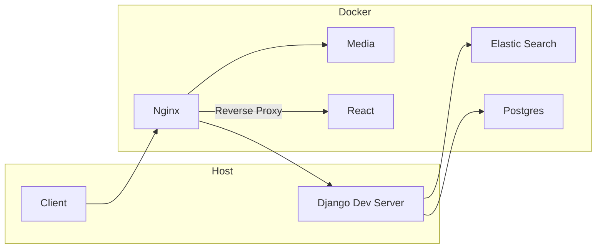

# Products-For-You

## Overview

Products-For-You is a e-commerce web site build with django-rest-framework and React.js.

### TECH STACK:

  **Front end**:

  React.js, redux-toolkit, rtk-query, scss with css modules

  **Back end**:

  Django, django-rest-framework, elastic-search, jwt-authentication, stripe payments

### Key Features

- faceted search, advanced search functionality using elastic search
- user authentication using jwt
- secure payments with stripe
- product management with tags, categories, custom variations
- ability to add favorite products
- shipping costs calculation using dimensional factor, different tax-rates application
- promotions-discounts system
- order history
- rating system

  ### regarding the ui ux
  - mobile-first responsive design
  - dark theme is provided


### Rating System
  - the user can provide an overall rating or rate different aspects of the product
  - groups of rating aspects can be associated with category of products & they can even overriden by the product if this is a necessity


#### Some Features regarding the react app
- custom validation hook
- custom notification system


## Installation - dev

### First setup

in this setup postgres, nginx, elastic-search, and react are running inside docker
django dev server is running on the host

nginx acts as a reverse proxy for the react app and drf

- media are served by nginx
- ssl is configured to allow correct cookie behavior




---

## SSL configuration

there are 2 options regarding running the dev servers with https

1) create ssl keys and cert and config the front end back dev servers

  -  install the ``openssl`` package
      - for arch systems it can be installed with ``sudo pacman -Sy openssl``

  - a folder have to be made inside the project and be added to .gitignore
    to store the keys

  - create certificates locally using openssl
  https://docs.starlingx.io/security/kubernetes/create-certificates-locally-using-openssl.html


  by default python runs the dev server in http

  ### stunnel as reverse proxy

  in arch systems in can be installed with ``pacman -Sy stunnel``

  inside the project a confing file can be created to run stunnel

  ``stunnel.conf``

  ```bash
  cert = <location of server.crt>
  key = <location of server.key>

  [https]
  accept = 8443
  connect = 8000
  TIMEOUTclose = 0

  ```

### nginx as reverse proxy

- install nginx ``sudo pacman -Syu && sudo pacman -Sy nginx``
- to config nginx from inside the project a symlink can be created pointing to the config
  inside the derired folder a file nginx.conf has to be created
  then
  ``ln -s /etc/nginx/modules.d/myconf.conf nginx.conf``


 1) there is the  plugin for vite ``vite-plugin-mkcert``
it can be installed using ``vite add vite-plugin-mkcert`

then inside vite.config.ts

 ```js
 import { defineConfig } from 'vite'
 import mkcert from 'vite-plugin-mkcert'

 export default defineConfig({
   plugins: [mkcert()],
   server: {
     https: true
   }
 })
```
after this setup it vite will serve the app through https


for django server there is the django-sslserver package that can be installed with pip.
https://github.com/teddziuba/django-sslserver

---

## Licence
[GNU](https://www.gnu.org/licenses/gpl-3.0.html)
